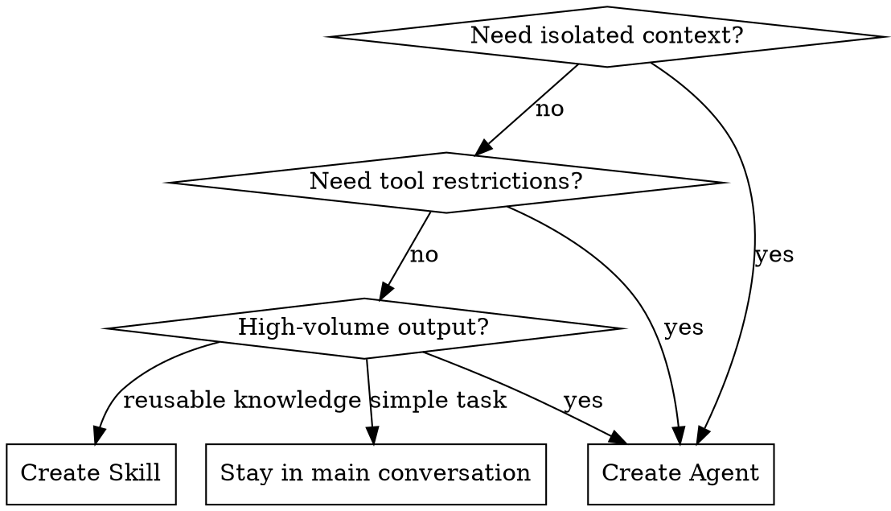
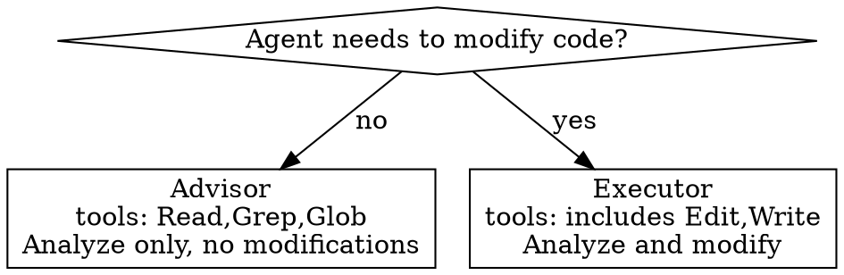
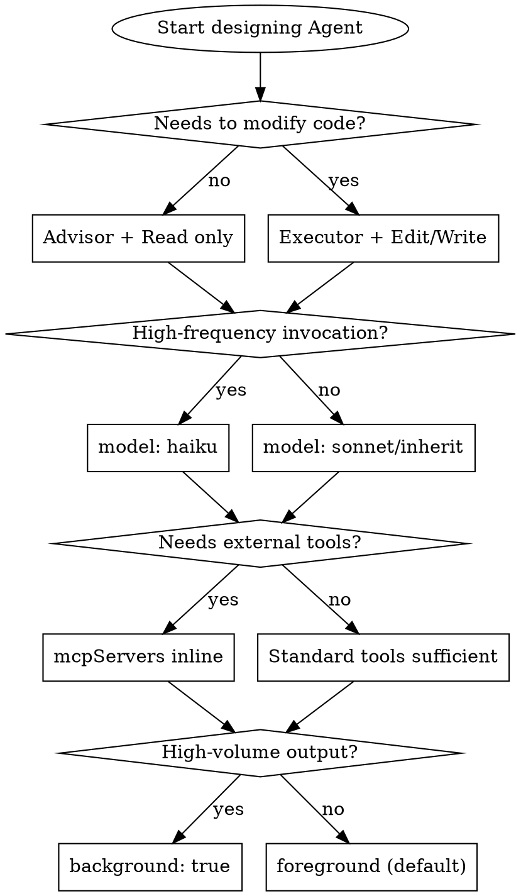

# Writing Agents

## Overview

An agent is a specialized AI assistant running in its own context window with a custom system prompt, specific tool access, and independent permissions. The core of a good agent: **single responsibility, description determines delegation timing, minimal tool permissions.**

**Key distinction from Skills:** Skills inject into the main conversation context (knowledge augmentation). Agents run in isolated context (task delegation). Wrong choice = wasted tokens or lost context.

## When to Use

**Create an Agent when:**
- Task produces high-volume output that should stay out of main context (tests, logs, doc fetching)
- Need to restrict tool permissions (read-only advisor, DB read-only)
- Self-contained work unit that returns a summary
- Need a different model (haiku for high-frequency lightweight tasks)

**Don't create an Agent when:**
- Reusable knowledge/workflow template → use a Skill
- Frequent back-and-forth interaction needed → stay in main conversation
- Multiple phases share significant context → stay in main conversation
- Just a quick question → use `/btw`



## File Format

Markdown files with YAML frontmatter. Storage location determines scope:

| Location | Scope | Priority |
|----------|-------|----------|
| `--agents` CLI JSON | Current session | 1 (highest) |
| `.claude/agents/` | Current project | 2 |
| `~/.claude/agents/` | All your projects | 3 |
| Plugin `agents/` | Where plugin is enabled | 4 (lowest) |

Same-name agents: higher priority wins.

## Frontmatter Schema

```yaml
---
name: my-agent              # Required. Lowercase letters and hyphens only
description: >              # Required. Claude uses this to decide when to delegate
  What it does. Use proactively when [trigger scenarios].
tools: Read, Grep, Glob     # Optional. Omit to inherit all tools
disallowedTools: Write, Edit # Optional. Tool denylist
model: sonnet               # Optional. sonnet/opus/haiku/inherit/full model ID
permissionMode: default      # Optional. default/acceptEdits/dontAsk/bypassPermissions/plan
maxTurns: 30                 # Optional. Max agentic turns
skills:                      # Optional. Skill content injected at startup (not inherited from parent)
  - api-conventions
mcpServers:                  # Optional. MCP servers (inline definition or name reference)
  - playwright:
      type: stdio
      command: npx
      args: ["-y", "@playwright/mcp@latest"]
  - github                   # Reference an already-configured server
hooks:                       # Optional. Lifecycle hooks
  PreToolUse:
    - matcher: "Bash"
      hooks:
        - type: command
          command: "./scripts/validate.sh"
memory: user                 # Optional. user/project/local
background: false            # Optional. true = always run in background
isolation: worktree          # Optional. worktree = run in isolated git worktree
---

System prompt content goes after the frontmatter (Markdown format).
The agent receives ONLY this system prompt + basic environment info,
NOT the full Claude Code system prompt.
```

### Required Fields

**`name`** — Unique identifier
- Lowercase letters and hyphens only: `code-reviewer`, `db-reader`
- No underscores, spaces, or special characters

**`description`** — Trigger conditions (the most critical field)
- Claude reads the description to decide whether to delegate. Wording directly affects auto-trigger rate
- Start with "Use when..." or "Use proactively when..."
- Describe **trigger scenarios**, not what the agent does
- Third person

```yaml
# BAD: Describes what it does
description: Reviews code for quality and suggests improvements

# BAD: Too vague
description: Helps with code

# GOOD: Describes trigger scenarios
description: >
  Expert code reviewer. Use proactively after writing or modifying code,
  before commits, or when code quality concerns arise.
```

### Optional Fields — Design Decisions

**`tools` — Principle of least privilege**

| Agent type | Recommended tools |
|------------|-------------------|
| Read-only advisor | `Read, Grep, Glob` |
| Read-only + execution | `Read, Grep, Glob, Bash` |
| Can modify code | `Read, Edit, Write, Bash, Grep, Glob` |
| Full capability | Omit (inherits all) |

Restrict which subagents can be spawned: `Agent(worker, researcher)` allowlist syntax. Note: subagents cannot spawn sub-subagents; this syntax only works for `--agent` main thread.

**`model` — Model tiering strategy**

| Model | Use case |
|-------|----------|
| `haiku` | High-frequency lightweight: code search, file discovery, simple analysis |
| `sonnet` | Balanced: code review, implementation, moderate complexity |
| `opus` | Deep reasoning: architecture decisions, complex debugging, research |
| `inherit` | Follow main conversation (default) |

**`memory` — Persistent memory**

When enabled, the agent gets a cross-session memory directory. Read/Write/Edit tools are auto-enabled:

| Scope | Path | Use when |
|-------|------|----------|
| `user` | `~/.claude/agent-memory/<name>/` | Cross-project general knowledge (recommended default) |
| `project` | `.claude/agent-memory/<name>/` | Project-specific, shareable via git |
| `local` | `.claude/agent-memory-local/<name>/` | Project-specific, not in git |

When enabling memory, add guidance in the system prompt:
```markdown
Update your agent memory as you discover patterns, conventions, and key
architectural decisions. Write concise notes about what you found and where.
```

**`hooks` — Conditional control**

Use when `tools` allowlist/denylist granularity isn't enough. Typical case: allow Bash but only permit SELECT queries.

Supported events: `PreToolUse` (match tool name), `PostToolUse` (match tool name), `Stop` (auto-converted to SubagentStop).

**`skills` — Inject domain knowledge**

Subagents do NOT inherit parent conversation skills. Must declare explicitly. Full skill content is injected at startup.

**`background`** — Background agents run concurrently. Claude pre-requests all permissions before launch. Insufficient permissions auto-deny during execution.

**`isolation: worktree`** — Runs in a temporary git worktree. Auto-cleaned if no changes made.

## System Prompt Writing

The Markdown body after frontmatter IS the system prompt. The agent receives only this prompt, not the full Claude Code system prompt.

### Structure Template

```markdown
You are a [role]. [Core behavioral rule in 1-2 sentences].

## When invoked
1. [First action]
2. [Second action]
3. [Third action]

## [Domain-specific section]
- [Key rules or checklist]

## Output format
[How to structure return results]
```

### Writing Principles

1. **Lead with the role** — First sentence defines identity and core behavior
2. **Explicit action sequence** — "When invoked" lists concrete steps
3. **Output format** — Tell the agent how to organize results (main conversation only sees summary)
4. **Specify language** — If needed, explicitly write "Always respond in Chinese (中文)"
5. **Clear boundaries** — State what NOT to do: "You are NOT an executor. You diagnose and prescribe."
6. **Brevity is paramount** — Agent context is limited; every token has cost

### Advisor vs Executor



**Advisor (recommended default)** — AReaL "read-only agent principle": expert agents don't get write permissions; code modification authority returns to the main agent. Lower risk, higher summary quality.

**Executor** — Only when the task is self-contained (debugger needs to modify and verify, auto-formatting).

## Common Patterns

### 1. Read-only code review
```yaml
tools: Read, Grep, Glob, Bash
model: inherit
```
Bash for `git diff`; no Write/Edit.

### 2. High-frequency search (save cost with haiku)
```yaml
tools: Read, Grep, Glob
model: haiku
```

### 3. DB read-only with hook validation
```yaml
tools: Bash
hooks:
  PreToolUse:
    - matcher: "Bash"
      hooks:
        - type: command
          command: "./scripts/validate-readonly-query.sh"
```

### 4. Scoped MCP tools
```yaml
mcpServers:
  - playwright:
      type: stdio
      command: npx
      args: ["-y", "@playwright/mcp@latest"]
```
Inline definitions keep MCP tool descriptions out of main conversation context.

### 5. Domain expert with preloaded skills
```yaml
skills:
  - api-conventions
  - error-handling-patterns
```

## Anti-Patterns

| Mistake | Why it's wrong | Correct approach |
|---------|---------------|-----------------|
| Description says what agent does | Claude needs to know **when** to delegate | Describe trigger scenarios |
| All tools enabled (omit `tools`) | Overly permissive, higher risk | Least-privilege allowlist |
| System prompt too long (1000+ lines) | Agent context is limited, high token cost | Core guidance + `skills` field for detailed knowledge |
| Nested delegation design | Subagents cannot spawn subagents | Flat design; chain from main conversation |
| Copy skill content into prompt | Duplicate maintenance, version drift | Use `skills` field to inject |
| Write permissions on advisor agents | Violates read-only principle, lower summary quality | Analysis in agent, modifications in main conversation |
| Forget to specify output language | Agent doesn't inherit main conversation language preference | Explicitly write "respond in Chinese" |

## Quick Reference: Design Decision Tree



## Agent Creation Checklist

**IMPORTANT: Use TodoWrite to create a todo for EACH item.**

**Design phase:**
- [ ] Confirm need for Agent over Skill (isolated context / tool restrictions / high-volume output)
- [ ] Determine scope: project `.claude/agents/` or user `~/.claude/agents/`
- [ ] Determine role: advisor (read-only) or executor (can modify)

**Writing phase:**
- [ ] `name` uses only lowercase letters and hyphens
- [ ] `description` starts with "Use when..." and describes trigger scenarios (not what the agent does)
- [ ] `tools` follows least privilege — only necessary tools
- [ ] `model` chosen by task complexity (haiku/sonnet/opus/inherit)
- [ ] System prompt leads with role definition
- [ ] System prompt includes "When invoked" action sequence
- [ ] System prompt specifies output format and language
- [ ] Domain knowledge injected via `skills` field (not copied into prompt)

**Verification phase:**
- [ ] Natural language trigger test: does Claude auto-delegate to this agent?
- [ ] @mention test: `@"agent-name (agent)" [task]`
- [ ] Check returned summary is useful (not too long, not too short)
- [ ] Confirm tool restrictions work (out-of-scope operations should be denied)

**Deployment phase:**
- [ ] Project-level agents committed to git (team sharing)
- [ ] User-level agents confirmed available across projects
- [ ] If `memory` enabled, check memory directory contents after first run
