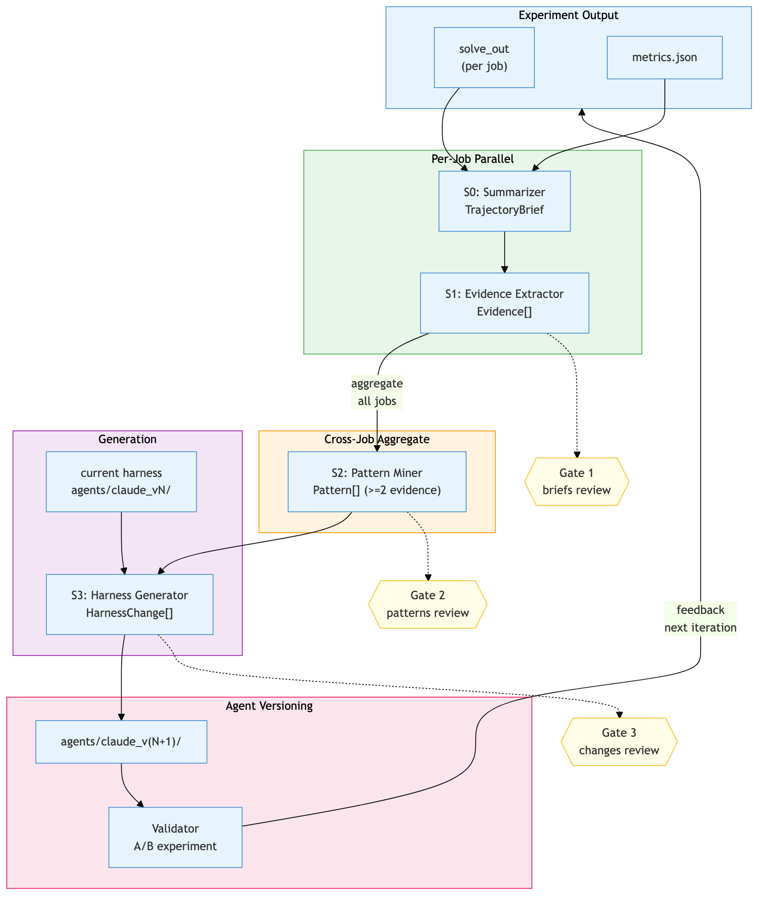
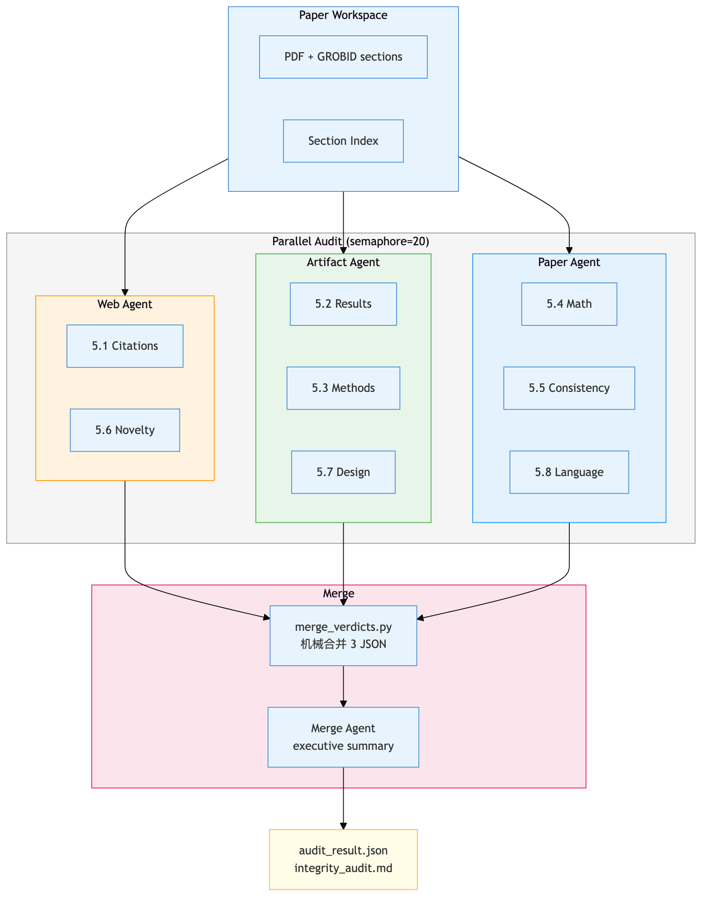
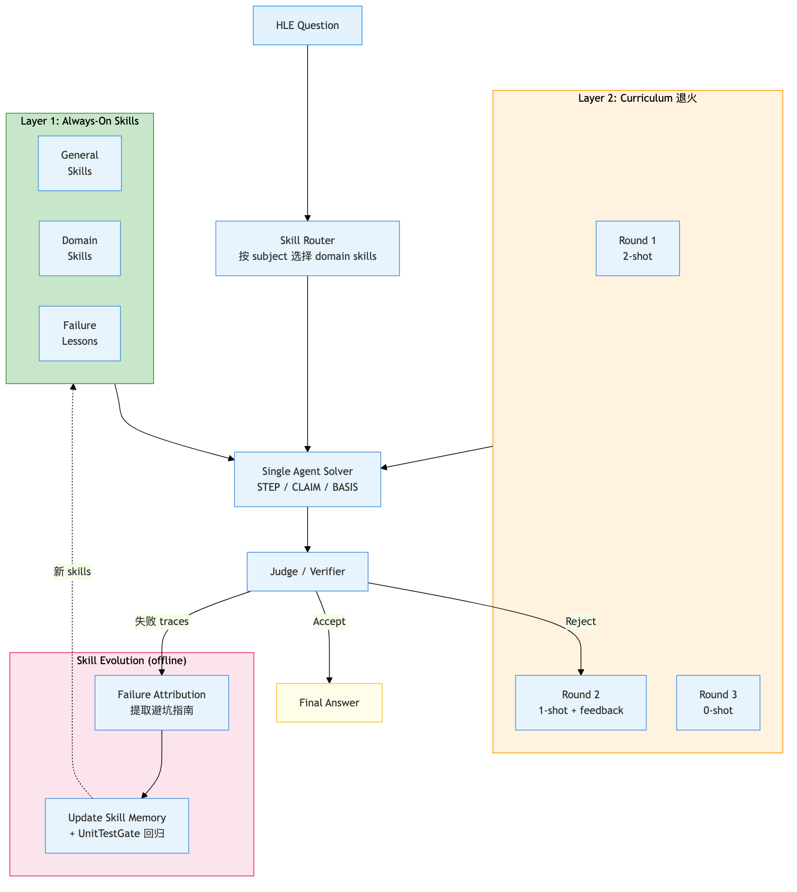

# 袁博 · 周报（3/19 – 3/26）

## 本周进展

### fars-autotrain

- exp00b（paper baseline，8 models × 7 benchmarks，无 agent）56/56 完成，全部 delta < 1.5% vs paper，eval pipeline 验证通过（`exp/exp00b/`）
- exp02a（claude/codex/lemma × gemma-3-4b，10h，gsm8k + bfcl）完成——codex bfcl 87%，claude gsm8k 57.9%（`exp/exp02a/`）
- 反思管线首次完整运行：exp02a 6 jobs → 58 evidence → 18 patterns → 12 harness changes → 自动生成 claude_v2（`reflect/runs/exp02a/meta.yaml`，设计：`docs/specs/2026-03-25-reflection-pipeline-design.md`）
- agent versioning 体系落地：v0（裸跑）→ v1（skill 注入）→ v2（反思产出），不可变快照链（`agents/CHANGELOG.md`，设计：`docs/specs/2026-03-25-log-to-skill-extraction-design.md`）
- 容器网络加固：mirror 自动测速 + 缓存校验 + 分级失败（设计：`docs/specs/2026-03-23-container-network-hardening-design.md`）
- FARS-2 系统总览文档完成，含架构图 + PostTrainBench 迭代 roadmap（`docs/fars-2-system-overview.md`）
- exp02b（claude/codex/lemma × gemma-3-4b，10h，7 benchmarks，多节点 GPU 隔离）准备启动（`exp/exp02b/`）

### fars-reviewer

- 3-agent 并行审计 pipeline 上线——拆为 artifact/paper/web 三个子 agent，保护 context + 细粒度审核（设计：`docs/specs/2026-03-23-parallel-audit-design.md`）
- v05 rubric：5.1/5.2/5.4 评分标准细化，prompt v03 26k → v05 30k（设计：`docs/specs/2026-03-24-v05-rubric-refinement-design.md`）
- section splitting + index 注入：论文按 section 拆分建索引，减轻单次 profiling 压力，为 8 页长文审计准备（设计：`docs/specs/2026-03-23-section-splitting-design.md`）
- 30 篇真实论文攻击数据集完成（涵盖 NLP/CV/RL/Bio），control/attack runner + 跨组分析器就位，准备跑 attack benchmark（设计：`docs/specs/2026-03-24-exp02-attack-bench-design.md`）

### hle-solver

- 梳理 7 篇相关工作（Memento-Skills, CBRL, SkillRL, AI Scientist, Aletheia, AlphaEvolve, Scaling Agent Systems），整理 7 个 research gaps（`docs/papers/landscape.md`）
- 核心发现：Memento-Skills 单 agent + skill memory 在 HLE 上 38.7%（+116%），验证 single-agent + evolving memory > multi-agent（`docs/papers/memento-skills.md`）
- 形成初步实验方案：skill-augmented single-agent + curriculum few-shot 退火注入（`docs/papers/cbrl+skillrl.md`）

## 架构图

### fars-autotrain: 反思管线

### fars-reviewer: 3-Agent 并行审计

### hle-solver: Single Agent + Skill Evolution

## 下周计划

> TODO

## 需要协作项

> TODO
